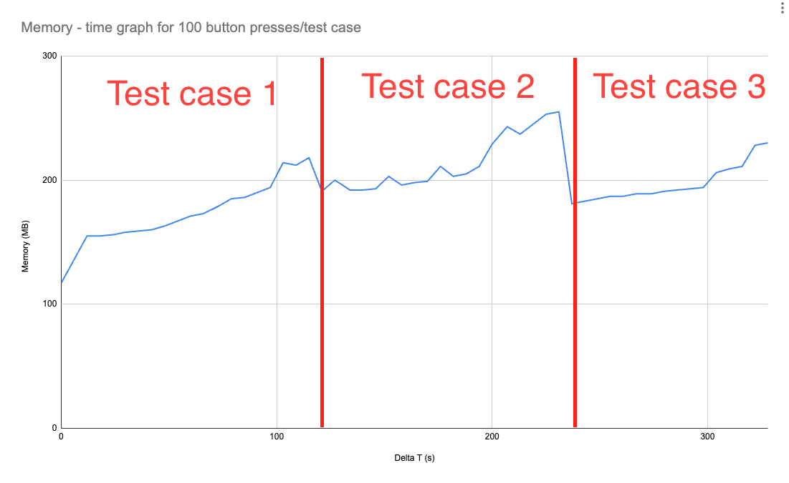
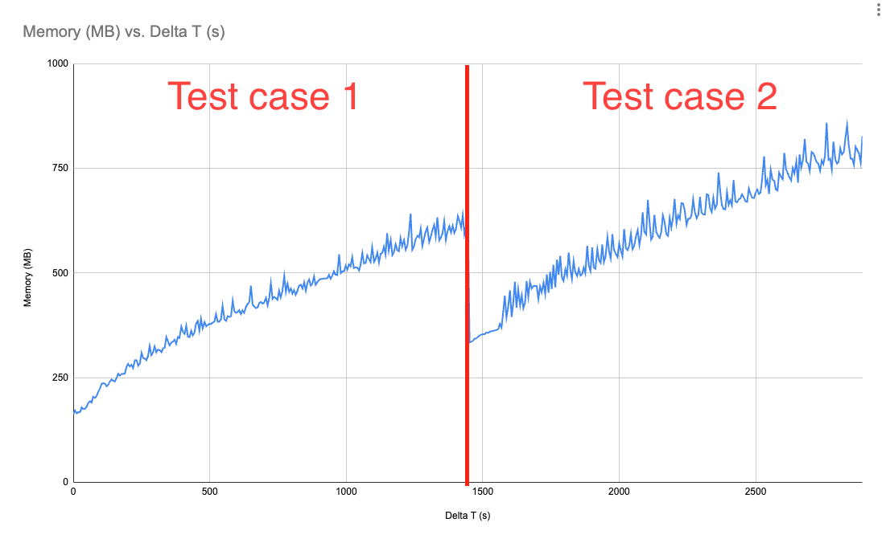
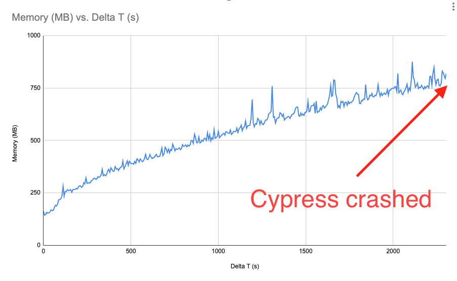

# Cypress OOM

A small repo with which one could easily see the memory issuus with cypress. The webserver is
purposfully a small overhead node server, so that any memory increase could attributed to cypress

## How to use it
0. Install dependenies with `npm install`
1. Start node server
```
node webservers/server.js
```
2. Start exectuing cypress test/tests (note profiler can only handle one cypress execution)
```
npx cypress run --spec cypress/e2e/100.cy.js
```
3. Start the profiler which will save the results to a csv file
```
sh profiler.sh
```

## Results

### Running 100 clicks test case


While there is a small increase in this case in between the test cases, but that is neglegtable. At the end of every test case the memory is mostly cleared.


### Running 1000 clicks test case


Same as before, there is a small uptick from the initial start, but that could because some inital state loading, once the test cases is ended the memory is mostly cleared. The issue with this, that during


### Running 10000 clicks test case


Doing 10000 clicks in this example is not possible and the cypress runner crashed during the execution.

## Takeway
While the increase seems small and in this case can be said that the usage does not reflect real life scneario as test was executed for more than 30 minutes, but keep in mind:
 - the used server was very low weight, nowdays the client itself could use a large chunk of the available memory
 - the log generation is quite low (a couple log/second) in a real scenario several API calls could happen at once, thus populating the command log much faster
